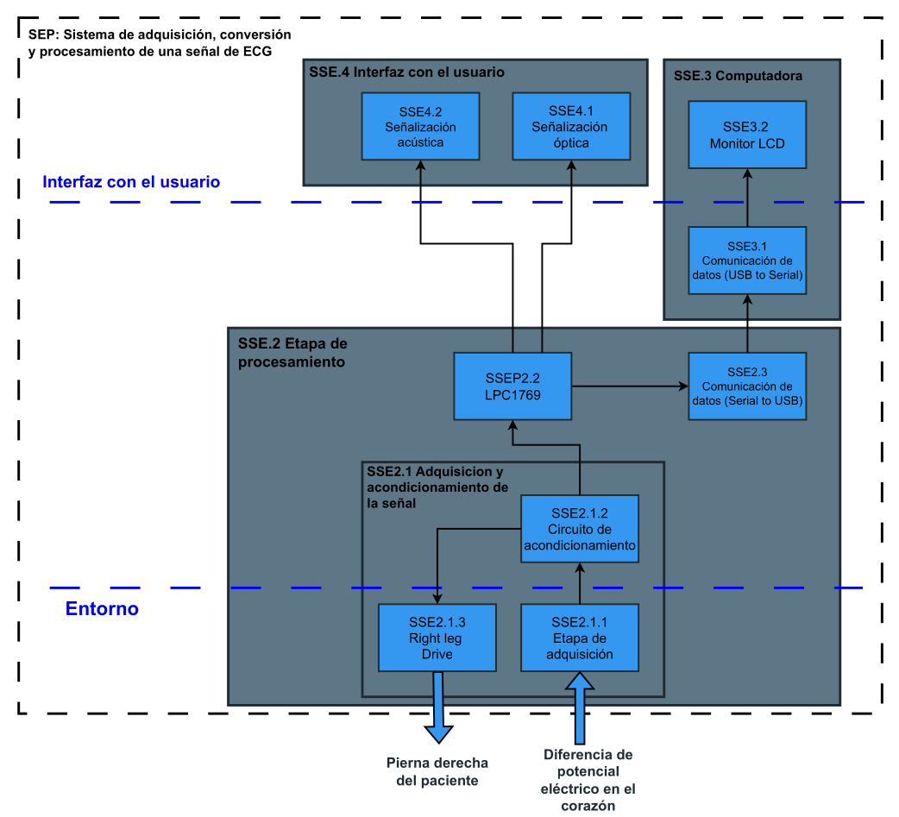
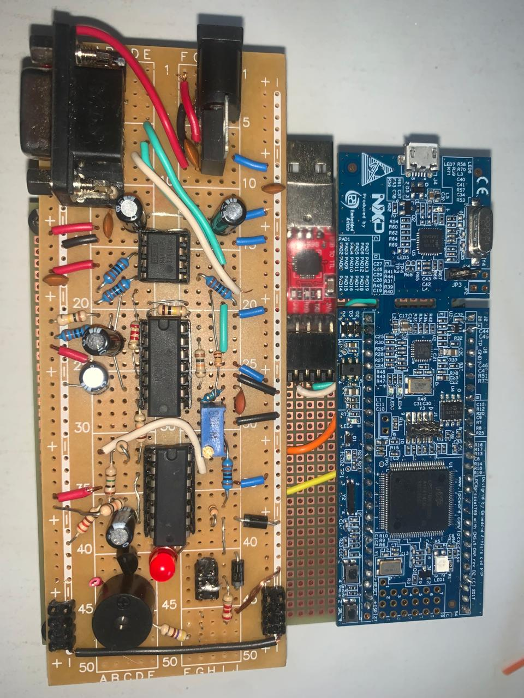
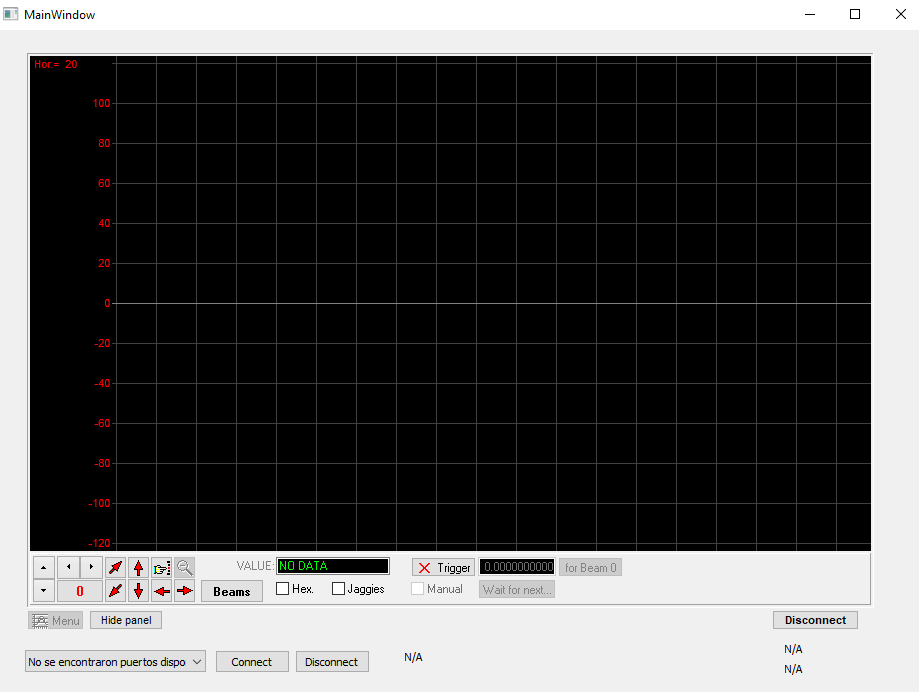

# Sistema de Adquisición, Conversión y Procesamiento de Señal ECG

**Trabajo Práctico Integrador - Electrónica Digital III** **Universidad Nacional de Córdoba - FCEFyN** **Año:** 2025

Este repositorio contiene el diseño de hardware, firmware y software para un sistema de electrocardiografía (ECG) digital de una derivación (Derivación II). El sistema adquiere la señal bioeléctrica, la acondiciona analógicamente, la procesa digitalmente en un microcontrolador LPC1769 y la transmite a una PC para su visualización en tiempo real mediante una aplicación desarrollada en python.

## Descripción General del Proyecto

El sistema está diseñado para capturar la actividad eléctrica cardíaca, eliminar ruidos característicos (como la interferencia de línea de 50Hz) y presentar los datos gráficamente.

**Diagrama de Bloques del Sistema:**


### Características Principales
* **Derivación:** II (Brazo derecho - Pierna izquierda).
* **Frecuencia de Muestreo:** 1 kHz.
* **Filtrado Digital:** Filtro IIR Notch para eliminación de 50 Hz.
* **Transmisión:** UART vía USB con uso de DMA.
* **Interfaz de Usuario:** Visualización en PC (Python/Qt) e indicadores LED en placa para detección de latidos (R-Peaks).

---

## Arquitectura del Hardware

El AFE (Analog Front End) está diseñado para amplificar señales del orden de los milivoltios y rechazar ruido de modo común.

1.  **Etapa de Adquisición:**
    * Electrodos Ag/AgCl.
    * Cable paciente apantallado.
2.  **Preamplificación:**
    * Amplificador de Instrumentación **INA114**.
    * Ganancia configurada: $G \approx 26$.
3.  **Reducción de Ruido (RLD):**
    * Circuito *Right Leg Drive* para inyectar la señal de modo común invertida y mejorar el CMRR.
4.  **Filtrado Analógico y Acondicionamiento:**
    * Filtro Pasa-Bajos **Sallen-Key de 2do orden** ($f_c \approx 108$ Hz) para anti-aliasing.
    * **DC Loop:** Realimentación para corrección de offset, centrando la señal en 200mV.
    * **VGA (Variable Gain Amplifier):** Ajuste de ganancia final para maximizar el rango dinámico del ADC (0 - 3.3V).
5.  **Alimentación:**
    * Fuente simétrica de $\pm 4.5$V derivada de baterías Li-Ion (11.1V) y reguladores lineales.



---

## Arquitectura del Firmware (LPC1769)

El firmware se ejecuta sobre un microcontrolador NXP LPC1769 (Cortex-M3).

* **ADC:** Disparo por Timer 0 a 1 kHz. Resolución de 12 bits reducida a 8 bits para transmisión.
* **Procesamiento Digital de Señales (DSP):**
    * Implementación de filtro **IIR Notch** utilizando la librería **CMSIS-DSP**.
    * Estructura: Biquad Cascade Direct Form I.
* **Gestión de Memoria:** Implementación de *Double Buffering* (Ping-Pong buffers) para adquisición y transmisión simultánea.
* **Comunicación:**
    * UART2 configurada a 8 bits, sin paridad, 1 bit de stop.
    * Transmisión asistida por **GPDMA** para liberar carga de la CPU.
* **Detección de QRS:** Algoritmo de umbral simple para detección de R-Peaks.
    * *Nota:* Se utiliza un LED para indicar el latido. El buzzer original fue deshabilitado debido a la inducción de ruido en la señal analógica.

---

## Software de Visualización (PC)

Aplicación de escritorio desarrollada en **Python** utilizando el framework **PyQt5**.

* **Funcionalidad:** Grafica la señal recibida por el puerto serial en tiempo real.
* **Backend:** Utiliza una DLL externa (`Osc_DLL64.dll`) para la renderización del osciloscopio virtual.
* **Cálculos:** Estimación de frecuencia cardíaca y FFT en la interfaz.



---

## Estructura del Repositorio

```bash
/
├── CMSISv2p00_LPC17xx/ # Drivers ligeramente modificados
├── dev/altium/         # Esquemáticos y diseño de PCB
├── dev/stm32/          # Software para simular en un stm32 latidos cardíacos
├── src/                # Código fuente para LPC1769 (LPCXpresso/MCUXpresso)
├── inc/                # Archivos de cabecera
├── gui/                # Script de Python para aplicación y dependencias
├── docs/               # Informe y documentación adicional
└── README.md
```

*Este proyecto fue desarrollado con fines académicos para la cátedra de Electrónica Digital III.*
